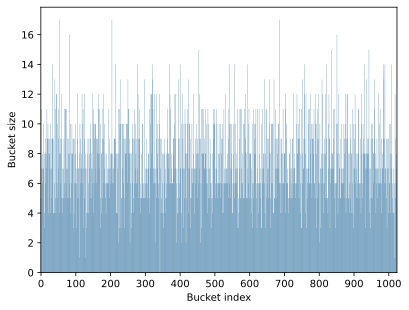
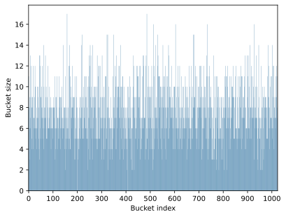
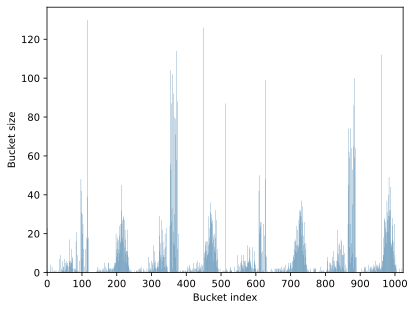
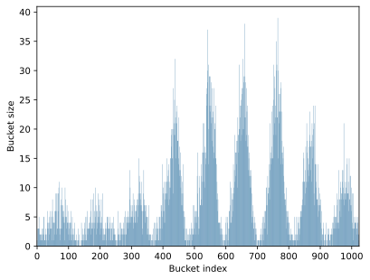
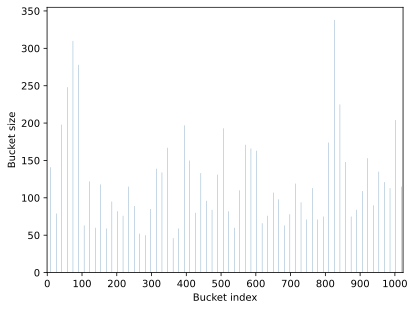
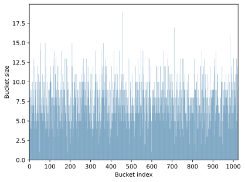

# Оптимизация хеш-таблицы с решением коллизий методом цепочек

## Введение

Хеш-таблица — это структура данных, которая обеспечивает быстрый доступ к элементам по ключу. Она использует хеш-функцию — алгоритм, преобразующий ключ (например, строку) в числовой индекс массива, где хранятся данные. Однако, из-за ограниченного размера массива могут возникать коллизии, когда разные ключи получают одинаковый индекс. Для их разрешения в данном проекте применяется **метод цепочек**: каждый элемент массива (бакет) представляет собой связанный список, в котором хранятся все ключи с одинаковым хешем.

Цель проекта — оптимизация производительности хеш-таблицы с использованием оптимизаций (в том числе аппаратно-зависимых) для повышения скорости поиска элементов.

## Описание данных

Данные для проекта взяты из книги **"Хоббит, или Туда и Обратно"**. Из текста были извлечены уникальные слова — всего **7796 слов**, каждое длиной до **29 букв** включительно. Эти слова хранятся в массиве, выровненном по **32 байта**, что улучшает доступ к памяти и совместимость с SIMD-инструкциями. Каждое слово занимает 32 байта.

## Структура элемента хеш-таблицы

```C
typedef struct string_t{
    char* string;
    uint32_t hash;
    uint32_t length;
} string_t;
```

`string` указывает на слово в массиве данных, `hash` - это ранее посчитанный хеш для данного слова, а `length` - длина этого слова. Индекс элемента в хеш-таблице - это остаток при делении хеша на размер таблицы.

## Структура хеш-таблицы

```C
typedef string_t data_t;
typedef uint32_t (*hash_t)(data_t data);

typedef struct HashMap{
    List* lists;
    uint32_t capacity;
    float load_factor;
    hash_t hash_func;
} HashMap;
```

Хеш-таблица хранит в себе указатель на массив бакетов - `lists`, свой размер - `capacity`, хеш-функцию - `hash_func` и действительный load factor - `load_factor`. **Load factor** - это отношение количества элементов в хеш-таблице к ее размеру. Чем он больше, тем чаще придется искать элементы в списках, а для строк это означает более частое использование `strcmp`.

В данной работе load factor - **7.61**.

Начальный размер хеш-таблицы - **1024**.

> [!NOTE]
> Большой load factor был взят намеренно в учебных целях для увеличения числа возможных аппаратных оптимизаций. Обычно в хеш-таблицах используется load factor меньше 1 для уменьшения количества коллизий на бакет и превалирующего поиска элементов по хешу, а не в списках.

> [!CAUTION]
> Автоматического перехеширования в хеш-таблице нет, потому что это долгая операция, которая может приводить к серьезным простоям.

В хеш-таблице реализованы следующие функции:
- `HashMap hashMapCtor(hash_t hash_func, uint32_t capacity)` : инициализатор хеш-таблицы, принимает указатель на хеш-функцию и изначальный размер хеш-таблицы (в данной работе `BASE_HASH_MAP_CAPACITY`).
- `uint32_t hashMapAddElement(HashMap* hashMap, data_t data)` : добавление элемента в хеш-таблицу, заблаговременно приведенного к `data_t`.
- `uint32_t hashMapPopElement(HashMap* hashMap, data_t data)` : удаление элемента по ключу - поле  `data_t`.
- `bool hashMapSearchElement(HashMap* hashMap, data_t data)` : поиск элемента по ключу - поле `data_t`
- `float getLoadFactor(HashMap* hashMap)` : получение load factor хеш-таблицы.
- `void hashMapDtor(HashMap* hashMap)` : деструктор хеш-таблицы, принимает указатель на таблицу.

Также, если вам необходимо изменить размер хеш-таблицы, реализована функция `HashMap resize(HashMap* hashMap, uint32_t new_capacity)`, которые возвращает новую хеш-таблицу с обновленным размером.

> [!NOTE]
> Так как хеш элемента хранится в структуре, то при вызове `resize` элементы не перехешируются, а просто изменяют свой индекс в хеш-таблице, что ускоряет функцию. Имейте в виду, что ее вызов все равно может приводить к простоям в таблице, так что рекомендуется изначально подобрать оптимальный размер хеш-таблицы.

## Использованные хеш-функции

> [!NOTE]
> Значения crc выбраны эмпирическим путем для уменьшение количества коллизий.

`crc32` с полиномом `0x11EDC6F41ULL` (Castagnoli). [Подробнее можно прочитать здесь](https://en.wikipedia.org/wiki/Cyclic_redundancy_check)

```C
uint32_t crc32HashString(string_t string){
    uint32_t hash  = 0;
    uint32_t chars = 0;
    uint32_t crc   = 0x11111111;
    int remainder  = 0;
    int length     =  int(string.length);

    for (int i = 0; i < length - 1; i += 4){
        chars = *(uint32_t*)(string.string + i);
        hash += crc32_u32(crc, chars);
    }

    return hash;
}

static uint32_t bitsReverse(uint32_t num){
    num = ((num & 0xAAAAAAAA) >> 1) | ((num & 0x55555555) << 1);
    num = ((num & 0xCCCCCCCC) >> 2) | ((num & 0x33333333) << 2);
    num = ((num & 0xF0F0F0F0) >> 4) | ((num & 0x0F0F0F0F) << 4);
    num = ((num & 0xFF00FF00) >> 8) | ((num & 0x00FF00FF) << 8);
    num = ((num & 0xFFFF0000) >> 16) | ((num & 0x0000FFFF) << 16);

    return num;
}

static uint32_t crc32_u32(uint32_t crc, uint32_t v){
    uint32_t tmp1 = bitsReverse(v);
    uint32_t tmp2 = bitsReverse(crc);

    uint64_t tmp = ((uint64_t)tmp1 << 32) ^ ((uint64_t)tmp2 << 32);

    uint64_t polynomial = 0x11EDC6F41ULL;

    for (int i = 0; i < 32; i++){
        if (tmp & (1ULL << (63 - i))){
            tmp ^= (polynomial << (31 - i));
        }
    }

    uint32_t result = bitsReverse((uint32_t)tmp);

    return result;
}
```

`murmur2` - второй хеш из семейства murmur. [Подробнее можно прочитать здесь](https://en.wikipedia.org/wiki/MurmurHash)

```C
uint32_t murmur2HashString(string_t string){
    uint32_t num    = 0x5bd1e995;
    uint32_t seed   = 0;
    int32_t  shift  = 24;
    uint32_t length = string.length;
    unsigned char* data = (unsigned char*)string.string;

    uint32_t hash    = seed ^ length;
    uint32_t xor_num = 0;

    while (length >= 4)
    {
        xor_num  = data[0];
        xor_num |= data[1] << 8;
        xor_num |= data[2] << 16;
        xor_num |= data[3] << 24;

        xor_num *= num;
        xor_num ^= xor_num >> shift;
        xor_num *= num;

        hash *= num;
        hash ^= xor_num;

        data += 4;
        length -= 4;
    }

    switch (length)
    {
        case 3:
        hash ^= data[2] << 16;
        case 2:
        hash ^= data[1] << 8;
        case 1:
        hash ^= data[0];
        hash *= num;
    };

    hash ^= hash >> 13;
    hash *= num;
    hash ^= hash >> 15;

    return hash;
}
```

`sum` - хеш-функция, которая просто считывает сумму char в слове.

```C
uint32_t sumHashString(string_t string){
    uint32_t hash  = 0;
    uint32_t chars = 0;
    int remainder  = 0;

    for (; remainder < int(string.length) - 3; remainder += 4){
        chars = *(uint32_t*)(string.string + remainder);
        hash += chars;
    }

    chars = 0;
    for (int i = remainder; i < string.length; i++){
        chars = chars * 256 + string.string[i];
    }
    for (int i = 4 - string.length % 4; i > 0; i--){
        chars *= 256;
    }
    if (chars != 0) hash += chars;

    return hash;
}
```

`adler32` - хеш-функция, разработанная Марком Адлером. Данный алгоритм расчёта контрольной суммы отличается от CRC32 производительностью (adler32 быстрее). [Подробнее можно прочитать здесь](https://en.wikipedia.org/wiki/Adler-32)

```C
uint32_t adler32HashString(string_t string){
    uint32_t A = 1;
    uint32_t B = 0;
    uint32_t mod_adler = 65521;

    for (int i = 0; i < string.length; i++)
    {
        A = (A + string.string[i]) % mod_adler;
        B = (B + A) % mod_adler;
    }

    return (B << 16) | A;
}
```

`elf` - хеш, использованный в Unix ELF формате. [Подробнее можно прочитать здесь](https://en.wikipedia.org/wiki/PJW_hash_function)

```C
uint32_t elfHashString(string_t string){
    uint32_t hash = 0;
    uint32_t high = 0;
    for (int i = 0; i < string.length; i++){
        hash = (hash << 4) + string.string[i];

        if (high = hash & 0xF0000000) hash ^= high >> 24;

        hash &= ~high;
    }
    return hash;
}
```

## Тестирование и оптимизация

**Тест коллизий:** один раз строилась хеш-таблица с определенной хеш-функицей и считалось количество элементов в каждом бакете. Достаточно одного построения, так как коллизии остаются постоянными (если хеш-функция реализована правильно).

**Тест поиска** проводился следующим образом: создавался массив случайных элементов из исходного набора данных, после чего измерялось время поиска этих элементов в хеш-таблице. Ниже описаны этапы оптимизации.

### Шаг 1: Начальное тестирование без флагов

**Тестирование поиска:** 100 тестов по 1000000 поисков.

На первом этапе были протестированы хеш-функции без флагов оптимизации компилятора.
Вот таблица, построенная на основе данных о результатах тестирования хеш-функций:

| Хеш-функция     | Среднее время поиска (мс) | Стандартное отклонение времени (мс) | Процентная ошибка (%) | Коллизии | σ (стандартное отклонение коллизий) |
|-----------------|---------------------------|-------------------------------------|-----------------------|----------|-------------------------------------|
| crc32           | 488349.65                 | 16259.34                            | 3.33                  | 7.61     | 2.66                                |
| murmur2         | 131433.72                 | 3772.29                             | 2.87                  | 7.61     | 2.77                                |
| sum             | 251552.22                 | 16589.97                            | 6.60                  | 7.61     | 15.65                               |
| adler32         | 190853.22                 | 3324.39                             | 1.74                  | 7.61     | 7.37                                |
| elf             | 746580.99                 | 27929.67                            | 3.74                  | 7.61     | 33.29                               |

Графики коллизий:

### crc32:

<p align="center"> </p>

### murmur2:

<p align="center"> </p>

### sum:

<p align="center"> </p>

### adler32:

<p align="center"> </p>

### elf:

<p align="center"> </p>

Можно составить топ хеш-функций по:

- **Времени:**
1. murmur2
2. adler32
3. sum
4. crc32
5. elf

- **Стандартному отклонению коллизий:**
1. crc32
2. murmur2
3. adler32
4. sum
5. elf

Дальше оптимизировать будем, выбрав только одну хеш-функцию. В среднем кажется, что murmur2 - это лучший выбор (она и правда хороша), но для crc32 существуют интринсики, поэтому если `crc32HashString` заменить на:

```C
uint32_t _mm_crc32HashString(string_t string){
    uint32_t hash  = 0;
    uint32_t chars = 0;
    uint32_t crc   = 0x11111111;
    int length     =  int(string.length);

    for (int i = 0; i < length - 1; i += 4){
        chars = *(uint32_t*)(string.string + i);
        hash += _mm_crc32_u32(crc, chars);
    }

    return hash;
}
```

то получится та же хеш-функция, но быстрее:

- **Среднее время поиска:** 106695.74 мс
- **Стандартное отклонение времени:** 3155.33 мс
- **Процентная ошибка:** 2.96%

что сразу поднимает ее на 1-ое место по времени. Самое длинное слово состоит из 29 букв, то есть максимум будет **7 итераций** цикла. Давайте немного изменим функцию и получим фиксированное количество в **4 "итерации"**:

```C
uint32_t _mm_crc32UnrollHashString(string_t string){
    uint32_t hash  = 0;
    uint32_t chars = 0;
    uint64_t crc   = 0x1212121121111111;

    uint64_t hash1 = *(uint64_t*)(string.string);
    uint64_t hash2 = *(uint64_t*)(string.string + 8);
    uint64_t hash3 = *(uint64_t*)(string.string + 16);
    uint64_t hash4 = *(uint64_t*)(string.string + 24);


    hash1 = _mm_crc32_u64(crc, hash1);
    hash2 = _mm_crc32_u64(crc, hash2);
    hash3 = _mm_crc32_u64(crc, hash3);
    hash4 = _mm_crc32_u64(crc, hash4);

    hash  = hash1 + hash2 + hash3 + hash4;

    return hash;
}
```

Мы уменьшили количество итераций и совершили раскрытие цикла, чтобы компилятору было легче применять свои оптимизации, что может привести к заметному ускорению.

- **Среднее время поиска:** 103616.68 мс
- **Стандартное отклонение времени:** 2816.31 мс
- **Процентная ошибка:** 2.72%
- **Стандартное отклонение коллизий**: 2.64

График коллизий `_mm_crc32Unroll`:

<p align="center"> </p>

### Шаг 2: Тестирование с флагом O3

**Тестирование поиска:** 100 тестов по 1000000 поисков.

С использованием флага оптимизации `-O3` производительность улучшилась. Результаты:

| Хеш-функция     | Среднее время поиска (мс) | Стандартное отклонение времени (мс) | Процентная ошибка (%) |
|-----------------|---------------------------|-------------------------------------|-----------------------|
| crc32           | 391546.77                 | 12619.40                            | 3.22                  |
| _mm_crc32       | 83277.69                  | 2120.00                             | 2.55                  |
| _mm_crc32Unroll | 82388.13                  | 1829.93                             | 2.22                  |
| murmur2         | 93346.97                  | 1619.66                             | 1.74                  |
| sum             | 183716.68                 | 6176.15                             | 3.36                  |
| adler32         | 132540.09                 | 4137.47                             | 3.12                  |
| elf             | 529455.36                 | 12735.30                            | 2.41                  |


- **crc32:** Среднее время поиска — 391546.77 мс, улучшение на **19.84%** по сравнению с 488349.65 мс.
- **_mm_crc32:** Среднее время поиска — 83277.69 мс, улучшение на **21.97%** по сравнению с 106695.74 мс.
- **_mm_crc32Unroll:** Среднее время поиска — 82388.13 мс, улучшение на **20.48%** по сравнению с 103616.68 мс.
- **murmur2:** Среднее время поиска — 93346.97 мс, улучшение на **28.97%** по сравнению с 131433.72 мс.
- **sum:** Среднее время поиска — 183716.68 мс, улучшение на **26.97%** по сравнению с 251552.22 мс.
- **adler32:** Среднее время поиска — 132540.09 мс, улучшение на **30.56%** по сравнению с 190853.22 мс.
- **elf:** Среднее время поиска — 529455.36 мс, улучшение на **29.10%** по сравнению с 746580.99 мс.

### Шаг 3: Выбор хеш-функции

На основе результатов была выбрана функция `_mm_crc32Unroll` как наиболее быстрая и c наименьшим стандартным отклонением по коллизиям.

### Шаг 4: Анализ с помощью Valgrind

Профилирование с помощью Valgrind показало, что основным узким местом является функция `strcmp`. Это связано с частыми сравнениями строк при поиске в цепочках.

```Valgrind
--------------------------------------------------------------------------------
Ir                    file:function
--------------------------------------------------------------------------------
973,521,544 (42.67%)  ./string/../sysdeps/x86_64/multiarch/strcmp-avx2.S:__strcmp_avx2 [/usr/lib/x86_64-linux-gnu/libc.so.6]
742,238,480 (32.53%)  src/list.cpp:searchElement(List*, string_t) [/root/hashMap/build/main]
260,000,000 (11.40%)  src/hash_map.cpp:hashMapSearchElement(HashMap*, string_t) [/root/hashMap/build/main]
```

### Шаг 5: Оптимизация strcmp

**Тестирование поиска:** 1000 тестов по 1000000 поисков.

Для устранения узкого места была разработана собственная функция `my_strcmp`, использующая AVX2-инструкции:

```asm
my_strcmp:
    vmovdqa ymm0, [rdi]
    vmovdqa ymm1, [rsi]

    vpcmpeqq ymm2, ymm0, ymm1
    vpmovmskb eax, ymm2

    not eax

    ret
```

или же версия с адресами
```asm
0000000000003b40 <my_strcmp>:
    3b40:	c5 fd 6f 07          	vmovdqa ymm0,YMMWORD PTR [rdi]
    3b44:	c5 fd 6f 0e          	vmovdqa ymm1,YMMWORD PTR [rsi]
    3b48:	c4 e2 7d 29 d1       	vpcmpeqq ymm2,ymm0,ymm1
    3b4d:	c5 fd d7 c2          	vpmovmskb eax,ymm2
    3b51:	f7 d0                	not    eax
    3b53:	c3                   	ret
```

Все слова занимают ровно по 32 байта, поэтому умещаются в регистры `ymm`, причем они выровнены, что повзоляет использовать версию инструкций для выровненных данных, соответственно ускоряя работу функции.

Результаты после оптимизации: среднее время поиска снизилось до **61938.46 мс** (σ = 2322.45 мс, 3.75%), улучшение на **24.82%**.

### Шаг 6: Инлайнинг функции хеширования

Профилируем еще раз с помощью Valgrind:

```Valgrind
--------------------------------------------------------------------------------
Ir                    file:function
--------------------------------------------------------------------------------
694,551,940 (44.90%)  src/list.cpp:searchElement(List*, string_t) [/root/hashMap/build/main]
286,981,092 (18.55%)  ???:0x0000000000003b40 [/root/hashMap/build/main]
260,000,000 (16.81%)  src/hash_map.cpp:hashMapSearchElement(HashMap*, string_t) [/root/hashMap/build/main]
```

`strcmp` исчез, но появилась неизвестная функция `???:0x0000000000003b40`. Если сопоставить адрес (3b40), то можно понять, что это новый `my_strcmp`.

Функция `searchElement` выглядит так:

```C
int searchElement(List* list, data_t data){
    assert(list);

    uint32_t inx = list->list_elems[0].next_inx;

    while (inx != 0){
        if (cmpListElems(&data, &list->list_elems[inx].data) == 0) return inx;

        inx = list->list_elems[inx].next_inx;
    }

    return inx;
}
```

причем `cmpListElems` на самом деле инлайнится и по итогу просто вызывается `my_strcmp`:

```asm
0000000000002190 <_Z13searchElementP4List8string_t>:
    ...
    21cc:	48 8b 74 18 10       	mov    rsi,QWORD PTR [rax+rbx*1+0x10]
    21d1:	e8 6a 19 00 00       	call   3b40 <my_strcmp>
    21d6:	85 c0                	test   eax,eax
    ...
```

По моему мнению, пока ничего особо здесь и не прооптимизируешь, так что двинемся дальше: к функции `hashMapSearchElement`:

```C
bool hashMapSearchElement(HashMap* hashMap, data_t data){
    assert(hashMap);

    uint32_t supposed_index = hashMap->hash_func(data) % hashMap->capacity;

    uint32_t inx = searchElement(&hashMap->lists[supposed_index], data);

    if (inx == 0) return false;

    return true;
}
```

Как видно, хеш-функция вызывается по указателю в качестве поля структуры HashMap. Это приводит к зависимости по данным, так как чтобы перейти по адресу функции его сначало нужно выгрузить из памяти:

```asm
0000000000001860 <_Z20hashMapSearchElementP7HashMap8string_t>:
    ...
    1879:	48 89 d6             	mov    rsi,rdx
    187c:	ff 53 10             	call   QWORD PTR [rbx+0x10]
    187f:	31 d2                	xor    edx,edx
    ...
```

Решим эту проблему ручным инлайнингом хеш-функции:

```C
bool hashMapSearchElement(HashMap* hashMap, data_t data){
    assert(hashMap);

    uint32_t hash  = 0;
    uint32_t chars = 0;
    uint64_t crc   = 0x1212121121111111;

    uint64_t hash1 = *(uint64_t*)(data.string);
    uint64_t hash2 = *(uint64_t*)(data.string + 8);
    uint64_t hash3 = *(uint64_t*)(data.string + 16);
    uint64_t hash4 = *(uint64_t*)(data.string + 24);


    hash1 = _mm_crc32_u64(crc, hash1);
    hash2 = _mm_crc32_u64(crc, hash2);
    hash3 = _mm_crc32_u64(crc, hash3);
    hash4 = _mm_crc32_u64(crc, hash4);

    hash  = hash1 + hash2 + hash3 + hash4;

    uint32_t supposed_index = hash % hashMap->capacity;


    uint32_t inx = searchElement(&hashMap->lists[supposed_index], data);

    if (inx == 0) return false;

    return true;
}
```

Результаты: среднее время поиска — **62929.24 мс** (σ = 2226.83 мс, 3.54%). Время не улучшилось, а даже ухудшилось. Проведем еще несколько тестов:

### Таблица 1: Результаты без оптимизации инлайна хеш-функции
| Итерация | Среднее время поиска (мс) | Стандартное отклонение времени (мс) | Процентная ошибка (%) |
|----------|---------------------------|-------------------------------------|-----------------------|
| 1        | 62132.26                  | 1658.15                             | 2.67                  |
| 2        | 61769.82                  | 2013.93                             | 3.26                  |
| 3        | 62952.78                  | 1711.90                             | 2.72                  |
| 4        | 61277.61                  | 1604.06                             | 2.62                  |
| 5        | 61699.78                  | 887.18                              | 1.44                  |

### Таблица 2: Результаты с оптимизацией инлайна хеш-функции
| Итерация | Среднее время поиска (мс) | Стандартное отклонение времени (мс) | Процентная ошибка (%) | Улучшение времени поиска (%) |
|----------|---------------------------|-------------------------------------|-----------------------|------------------------------|
| 1        | 61802.47                  | 1092.90                             | 1.77                  | 0.53                         |
| 2        | 61364.97                  | 1586.20                             | 2.58                  | 0.66                         |
| 3        | 61004.51                  | 1313.10                             | 2.15                  | 3.09                         |
| 4        | 61565.20                  | 1657.83                             | 2.69                  | -0.47                        |
| 5        | 61603.65                  | 1959.32                             | 3.18                  | 0.16                         |

Как видно, почти все улучшения не выходят за предел процентной ошибки - это значит, что мы не можем говорить о приросте производительности. Инлайн хеш-функции не повлиял на производительность.

### Шаг 7: Оптимизация остатка от деления

В той же функции `hashMapSearchElement` мы находим остаток от `hashMap->capacity`, чтобы получить индекс элемента, который подойдет для хеш-таблицы. Но изначально хеш-таблица задается с помощью `BASE_HASH_MAP_CAPACITY = 2`. При каждом перехешировании эта величина увеличивается в 2 раза, то есть размер хеш-таблицы - это степени двойки. Тогда можно заменить дорогостоящую операцию деления (`div`) на побитовый и (`and`).

- Было: `uint32_t supposed_index = hashMap->hash_func(data) % hashMap->capacity;`

```asm
    1881:	4c 89 e6             	mov    rsi,r12
    1884:	f7 73 08             	div    DWORD PTR [rbx+0x8]
    1887:	48 8b 03             	mov    rax,QWORD PTR [rbx]
```

- Стало: `uint32_t supposed_index = hashMap->hash_func(data) & (hashMap->capacity - 1);`

```asm
    18a3:	83 ea 01             	sub    edx,0x1
    18a6:	21 d0                	and    eax,edx
    18a8:	48 8d 14 40          	lea    rdx,[rax+rax*2]
```

Результаты: среднее время поиска — **57949.40 мс** (σ = 2911.72 мс, 5.02%), улучшение на **7.91%**.

### Шаг 8: Инлайнинг my_strcmp

Вернемся к функции `searchElement`. Больше всего инструкций исполняется в этой функции (по Valgrind), поэтому осмотрим ее еще раз:

```asm
00000000000021b0 <_Z13searchElementP4List8string_t>:
    ...
    21ec:	48 8b 74 18 10       	mov    rsi,QWORD PTR [rax+rbx*1+0x10]
    21f1:	e8 6a 19 00 00       	call   3b60 <my_strcmp>
    21f6:	85 c0                	test   eax,eax
    ...
```

Из долгих функций здесь присутствует call на my_strcmp. Сначала мы сделали отдельную ассемблерную функцию, теперь пришло время вручную заинлайнить ее. Используем ассемблерные вставки:

```c
asm volatile (
    "vmovdqa (%1), %%ymm0\n\t"
    "vmovdqa (%2), %%ymm1\n\t"
    "vpcmpeqb %%ymm1, %%ymm0, %%ymm2\n\t"
    "vpmovmskb %%ymm2, %0\n\t"
    "not %0\n\t"
    : "=r"(result)
    : "r"(data1->string), "r"(data2->string)
    : "ymm0", "ymm1", "ymm2"
);
```

Результаты: среднее время поиска — **53345.03 мс** (σ = 3017.11 мс, 5.66%), улучшение на **7.95%**.

На этом моменте я решил остановиться, потому что поиск остальных оптимизаций уже будет занимать много дольше времени и давать меньшие проценты.

## Результаты и выводы

| Этап                        | Среднее время поиска (мс) | Улучшение (%) |
|-----------------------------|---------------------------|---------------|
| Без флагов (_mm_crc32Unroll)| 103616.68                 | -             |
| С O3                        | 82388.13                  | 20.48         |
| Оптимизация strcmp          | 61938.46                  | 24.82         |
| Инлайнинг хеш-функции       | 62929.24                  | -             |
| Оптимизация div → and       | 57949.40                  | 7.91          |
| Инлайнинг my_strcmp         | 53345.03                  | 7.95          |

Наиболее значительный прирост производительности обеспечили:
1. Оптимизация компилятором с флагом `-O3` (20.48%).
2. Замена `strcmp` на `my_strcmp` (24.82%).
3. Замена деления на побитовую операцию (7.91%) и инлайнинг `my_strcmp` (7.95%).

По итогу мы смогли ускорить поиск в хеш-таблице на **48.52%**.

Проект демонстрирует, как аппаратно-зависимые оптимизации и низкоуровневые улучшения могут значительно повысить производительность хеш-таблицы.

## Процессор
```
Architecture:             x86_64
  CPU op-mode(s):         32-bit, 64-bit
  Address sizes:          40 bits physical, 48 bits virtual
  Byte Order:             Little Endian
CPU(s):                   4
  On-line CPU(s) list:    0-3
Vendor ID:                GenuineIntel
  BIOS Vendor ID:         QEMU
  Model name:             QEMU Virtual CPU version 4.2.0
    BIOS Model name:      pc-i440fx-bionic  CPU @ 2.0GHz
    BIOS CPU family:      1
    CPU family:           6
    Model:                58
    Thread(s) per core:   1
    Core(s) per socket:   1
    Socket(s):            4
    Stepping:             9
    BogoMIPS:             4200.00
    Flags:                fpu vme de pse tsc msr pae mce cx8 apic sep mtrr pge mca cmov pat pse36 clflush mmx fxsr sse sse2 syscall nx pdpe1gb rdtscp lm constant_tsc rep_good nopl xtopology cpuid tsc_kn
                          own_freq pni pclmulqdq ssse3 fma cx16 pcid sse4_1 sse4_2 x2apic movbe popcnt tsc_deadline_timer aes xsave avx f16c rdrand hypervisor lahf_lm abm cpuid_fault pti ssbd ibrs ibpb
                          fsgsbase tsc_adjust bmi1 avx2 smep bmi2 erms invpcid rdseed adx smap xsaveopt arat md_clear
Virtualization features:
  Hypervisor vendor:      KVM
  Virtualization type:    full
Caches (sum of all):
  L1d:                    128 KiB (4 instances)
  L1i:                    128 KiB (4 instances)
  L2:                     16 MiB (4 instances)
  L3:                     64 MiB (4 instances)
```

## Навигация по проекту

Чтобы работать с реализованной хеш-таблицей, сначала склонируйте репозиторий к себе на машину:
```
git clone https://github.com/whiterno/hashMap.git
```

Сборка проекта производится с помощью `Cmake`, для удобной компиляции и проведения тестов созданы скрипты на `bash`: `compil.sh` и `tests.sh`.

При сборке вы можете использовать флаги компиляции, которые могут включать/выключать некоторые оптимизации:

- `O3` - при включении этого флага проект будет собираться с -O3.
- `SEARCH_ONLY` - флаг для тестирования, замеры будут происходить только на поисках.
- `STRCMP_OPTIMIZATION` - флаг, включающий оптимизацию strcmp. Работает для строк длины < 32, так как для сравнения используется по одному ymm регистру.
- `STRCMP_OPTIMIZATION_INLINE` - флаг, который инлайнит оптимизированный strcmp.
- `CRC32_OPTIMIZATION` - флаг, который инлайнит _mm_crc32Unroll в функцию поиска. При включении этого флага хеш-функция, которая хранится в структуре таблицы не используется.
- `REMAINDER_OPTIMIZATION` - флаг, включающий оптимизации деления с остатком. Чтобы он правильно работал, размер хеш-таблицы должен быть степенью двойки (2, 4, 8, ...).

Чтобы включить оптимизации, достаточно прописать:
```
./compile.sh -D<compile_option1>=ON  -D<compile_option2>=ON ... -D<compile_optionN>=ON
```

Не прописанные флаги по умолчанию имеют значение `OFF`.

### Тестирование

Если вы хотите провести тестирование на своей машине, реализован скрипт `tests.sh`.
```
./tests.sh <tests_amount> <hash_function> <is_plot_needed> [<compile_options>]
```

- `<tests_amount>` - количество тестов, которые необходимо провести.
- `<hash_function>` - название хеш-функции или `all`, чтобы провести тесты для всех. Название хеш-функций для аргумента:
- - `crc32`
- - `_mm_crc32`
- - `_mm_crc32Unroll`
- - `murmur2`
- - `sum`
- - `adler32`
- - `elf`
- `<is_plot_needed>` - строить ли график для тестов. `plot`, чтобы строить, любое другое значение не будет восприниматься.

Графики будет храниться в папке `plot`.
